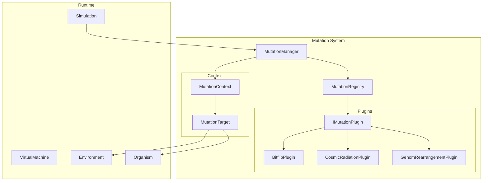
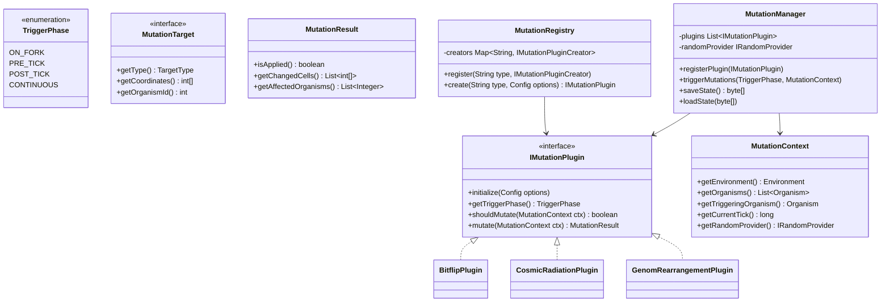

# Mutation Plugin System - Architektur-Plan

## Übersicht

Das Mutations-System soll ein flexibles Plugin-Modell bereitstellen, ähnlich zu den bestehenden Energy Strategies und Thermodynamic Policies. Es ermöglicht verschiedene Mutations-Konzepte von einfachen Bitflips bis zu komplexen Genom-Rearrangements.

## Anforderungen

### Funktionale Anforderungen
1. **Deterministisch**: Mutation muss reproduzierbar sein (nutzt `IRandomProvider`)
2. **Flexibler Zeitpunkt**: Mutation kann zu verschiedenen Zeitpunkten ausgelöst werden
   - Bei FORK (Reproduktion)
   - Kontinuierlich (jeder Tick)
   - Event-basiert (z.B. Cosmic Radiation)
3. **Flexibles Ziel**:
   - Environment-Daten (CODE, DATA, ENERGY, STRUCTURE Moleküle)
   - Interner Organismus-Zustand (Register, Stacks, Pointer)
4. **Plugin-basiert**: Verschiedene Mutations-Strategien konfigurierbar

### Mutations-Typen (Beispiele)
- **Bitflip**: Einzelne Bits in Molekül-Werten ändern
- **Point Mutation**: Einzelne Moleküle ersetzen
- **Insertion**: Neue Moleküle einfügen
- **Deletion**: Moleküle entfernen
- **Duplication**: Genom-Bereiche kopieren
- **Inversion**: Genom-Bereiche umkehren
- **Translocation**: Genom-Bereiche verschieben
- **Cosmic Radiation**: Zufällige Änderungen überall im Environment

## Architektur

### Komponenten-Diagramm



### Klassen-Struktur



## Integration in bestehende Architektur

### 1. Simulation.java - Mutations-Trigger

```java
public class Simulation {
    private final MutationManager mutationManager;
    
    public void tick() {
        // PRE_TICK mutations (z.B. Cosmic Radiation)
        mutationManager.triggerMutations(TriggerPhase.PRE_TICK, createContext());
        
        // ... existing tick logic ...
        
        // POST_TICK mutations
        mutationManager.triggerMutations(TriggerPhase.POST_TICK, createContext());
        
        this.currentTick++;
    }
}
```

### 2. StateInstruction.java - FORK Integration

```java
private void handleFork(...) {
    // ... existing fork logic ...
    
    // ON_FORK mutations für das Kind
    MutationContext ctx = createForkContext(child, parentMr);
    simulation.getMutationManager().triggerMutations(TriggerPhase.ON_FORK, ctx);
}
```

### 3. Konfiguration (evochora.conf)

```hocon
runtime {
  mutation {
    # Global mutation enable/disable
    enabled = true
    
    # Mutation plugins (similar to energyStrategies)
    plugins = [
      {
        className = "org.evochora.runtime.mutation.plugins.BitflipPlugin"
        options {
          # Probability per molecule per tick
          probability = 0.00001
          # Which molecule types to affect
          targetTypes = ["CODE", "DATA"]
          # Trigger phase
          triggerPhase = "CONTINUOUS"
        }
      },
      {
        className = "org.evochora.runtime.mutation.plugins.CosmicRadiationPlugin"
        options {
          # Events per tick
          eventsPerTick = 1
          # Probability per event
          probability = 0.001
          # Radius of effect
          radius = 3
          # Can affect organisms
          affectOrganisms = true
        }
      },
      {
        className = "org.evochora.runtime.mutation.plugins.ForkMutationPlugin"
        options {
          # Probability of mutation during fork
          probability = 0.1
          # Types of mutations
          mutationTypes = ["bitflip", "insertion", "deletion"]
          # Max mutations per fork
          maxMutations = 3
        }
      }
    ]
  }
}
```

## Plugin-Beispiele

### 1. BitflipPlugin

```java
public class BitflipPlugin implements IMutationPlugin {
    private double probability;
    private Set<Integer> targetTypes;
    
    @Override
    public void initialize(Config options) {
        this.probability = options.getDouble("probability");
        this.targetTypes = parseTargetTypes(options.getStringList("targetTypes"));
    }
    
    @Override
    public TriggerPhase getTriggerPhase() {
        return TriggerPhase.CONTINUOUS;
    }
    
    @Override
    public boolean shouldMutate(MutationContext ctx) {
        return ctx.getRandomProvider().nextDouble() < probability;
    }
    
    @Override
    public MutationResult mutate(MutationContext ctx) {
        // Select random cell
        int[] coord = selectRandomCell(ctx);
        Molecule mol = ctx.getEnvironment().getMolecule(coord);
        
        if (!targetTypes.contains(mol.type())) {
            return MutationResult.noChange();
        }
        
        // Flip random bit
        int bit = ctx.getRandomProvider().nextInt(Config.VALUE_BITS);
        int newValue = mol.value() ^ (1 << bit);
        
        ctx.getEnvironment().setMolecule(
            new Molecule(mol.type(), newValue, mol.marker()), 
            coord
        );
        
        return MutationResult.changed(coord);
    }
}
```

### 2. CosmicRadiationPlugin

```java
public class CosmicRadiationPlugin implements IMutationPlugin {
    private int eventsPerTick;
    private double probability;
    private int radius;
    private boolean affectOrganisms;
    
    @Override
    public TriggerPhase getTriggerPhase() {
        return TriggerPhase.PRE_TICK;
    }
    
    @Override
    public MutationResult mutate(MutationContext ctx) {
        List<int[]> changedCells = new ArrayList<>();
        List<Integer> changedOrganisms = new ArrayList<>();
        
        for (int event = 0; event < eventsPerTick; event++) {
            if (ctx.getRandomProvider().nextDouble() >= probability) continue;
            
            // Select random impact point
            int[] center = selectRandomCell(ctx);
            
            // Affect cells in radius
            for (int[] coord : getCellsInRadius(center, radius, ctx.getEnvironment())) {
                if (ctx.getRandomProvider().nextDouble() < 0.5) {
                    mutateCell(ctx, coord);
                    changedCells.add(coord);
                }
            }
            
            // Optionally affect organisms
            if (affectOrganisms) {
                for (Organism org : ctx.getOrganisms()) {
                    if (isInRadius(org.getIp(), center, radius)) {
                        mutateOrganism(ctx, org);
                        changedOrganisms.add(org.getId());
                    }
                }
            }
        }
        
        return new MutationResult(true, changedCells, changedOrganisms);
    }
    
    private void mutateOrganism(MutationContext ctx, Organism org) {
        // Mutate random register
        int regIndex = ctx.getRandomProvider().nextInt(Config.NUM_DATA_REGISTERS);
        Object value = org.getDr(regIndex);
        if (value instanceof Integer i) {
            int bit = ctx.getRandomProvider().nextInt(Config.VALUE_BITS);
            org.setDr(regIndex, i ^ (1 << bit));
        }
    }
}
```

### 3. ForkMutationPlugin

```java
public class ForkMutationPlugin implements IMutationPlugin {
    private double probability;
    private List<String> mutationTypes;
    private int maxMutations;
    
    @Override
    public TriggerPhase getTriggerPhase() {
        return TriggerPhase.ON_FORK;
    }
    
    @Override
    public MutationResult mutate(MutationContext ctx) {
        Organism child = ctx.getTriggeringOrganism();
        int childId = child.getId();
        
        // Find all cells owned by child (transferred from parent)
        List<int[]> childGenome = findCellsOwnedBy(ctx.getEnvironment(), childId);
        
        if (childGenome.isEmpty()) {
            return MutationResult.noChange();
        }
        
        int mutations = ctx.getRandomProvider().nextInt(maxMutations) + 1;
        List<int[]> changedCells = new ArrayList<>();
        
        for (int i = 0; i < mutations; i++) {
            String type = mutationTypes.get(
                ctx.getRandomProvider().nextInt(mutationTypes.size())
            );
            
            switch (type) {
                case "bitflip" -> changedCells.addAll(applyBitflip(ctx, childGenome));
                case "insertion" -> changedCells.addAll(applyInsertion(ctx, childGenome));
                case "deletion" -> changedCells.addAll(applyDeletion(ctx, childGenome));
                case "duplication" -> changedCells.addAll(applyDuplication(ctx, childGenome));
            }
        }
        
        return new MutationResult(true, changedCells, List.of(childId));
    }
}
```

## Datei-Struktur

```
src/main/java/org/evochora/runtime/
├── mutation/
│   ├── IMutationPlugin.java           # Plugin Interface
│   ├── IMutationPluginCreator.java    # Factory Interface
│   ├── MutationContext.java           # Context für Plugins
│   ├── MutationManager.java           # Orchestriert Plugins
│   ├── MutationRegistry.java          # Plugin Registry
│   ├── MutationResult.java            # Ergebnis einer Mutation
│   ├── TriggerPhase.java              # Enum für Trigger-Zeitpunkte
│   ├── target/
│   │   ├── MutationTarget.java        # Target Interface
│   │   ├── EnvironmentTarget.java     # Environment-Ziel
│   │   └── OrganismTarget.java        # Organismus-Ziel
│   └── plugins/
│       ├── BitflipPlugin.java         # Einfache Bitflips
│       ├── CosmicRadiationPlugin.java # Zufällige Strahlung
│       ├── ForkMutationPlugin.java    # Mutation bei Reproduktion
│       └── GenomRearrangementPlugin.java # Komplexe Genom-Änderungen
```

## Implementierungs-Reihenfolge

1. **Phase 1: Core Infrastructure**
   - [ ] `IMutationPlugin` Interface
   - [ ] `MutationContext` Klasse
   - [ ] `MutationResult` Klasse
   - [ ] `TriggerPhase` Enum
   - [ ] `MutationManager` Klasse
   - [ ] `MutationRegistry` Klasse

2. **Phase 2: Integration**
   - [ ] Integration in `Simulation.java`
   - [ ] Integration in `StateInstruction.java` (FORK)
   - [ ] Konfiguration in `evochora.conf`
   - [ ] `ISerializable` für Checkpointing

3. **Phase 3: Basic Plugins**
   - [ ] `BitflipPlugin`
   - [ ] `ForkMutationPlugin`

4. **Phase 4: Advanced Plugins**
   - [ ] `CosmicRadiationPlugin`
   - [ ] `GenomRearrangementPlugin`

5. **Phase 5: Testing & Documentation**
   - [ ] Unit Tests für alle Komponenten
   - [ ] Integration Tests
   - [ ] Dokumentation

## Offene Fragen

1. **Ownership bei Mutation**: Wenn ein Molekül mutiert wird, das einem Organismus gehört - soll die Ownership erhalten bleiben?

2. **Mutation-Logging**: Sollen Mutationen für Analytics/Debugging geloggt werden?

3. **Mutation-Kosten**: Sollen bestimmte Mutationen Energie kosten (z.B. bei Cosmic Radiation)?

4. **Schutz-Mechanismen**: Sollen Organismen sich gegen Mutation schützen können (z.B. durch STRUCTURE-Moleküle)?
